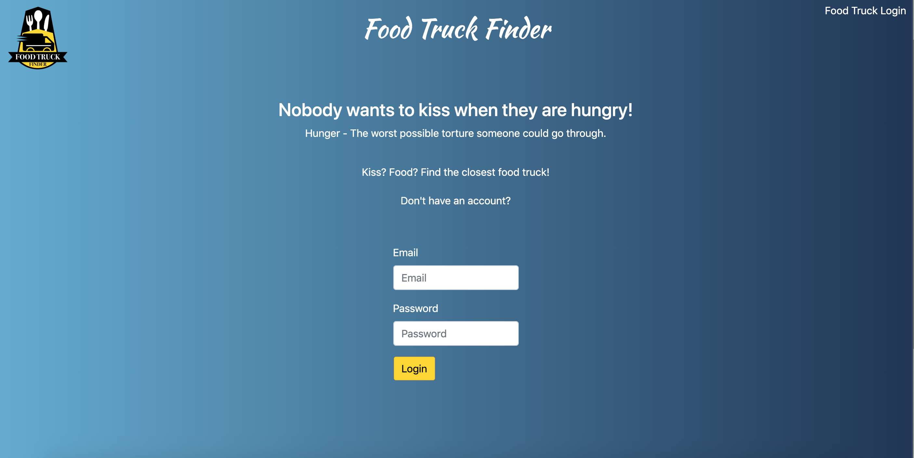
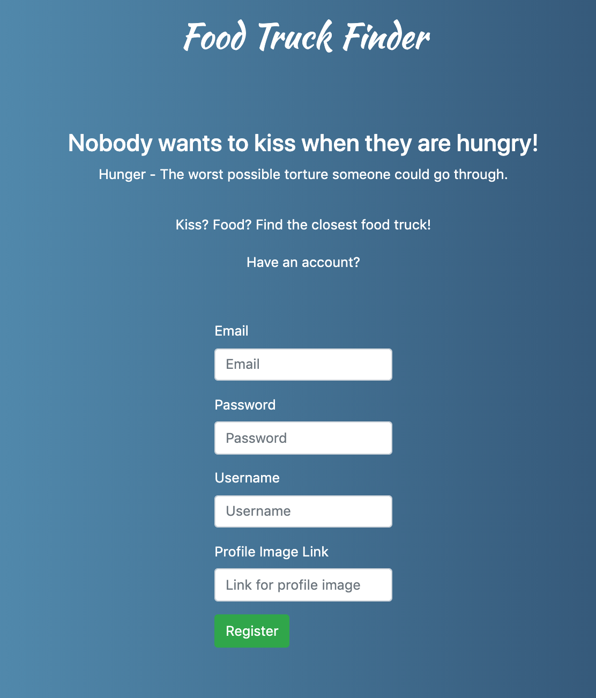
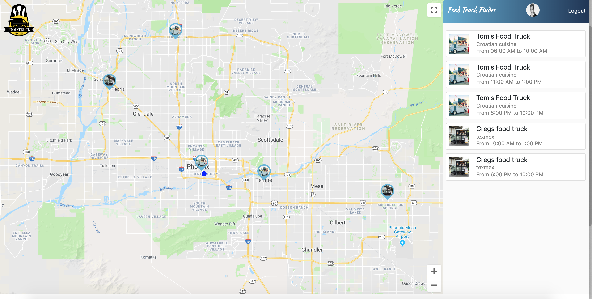
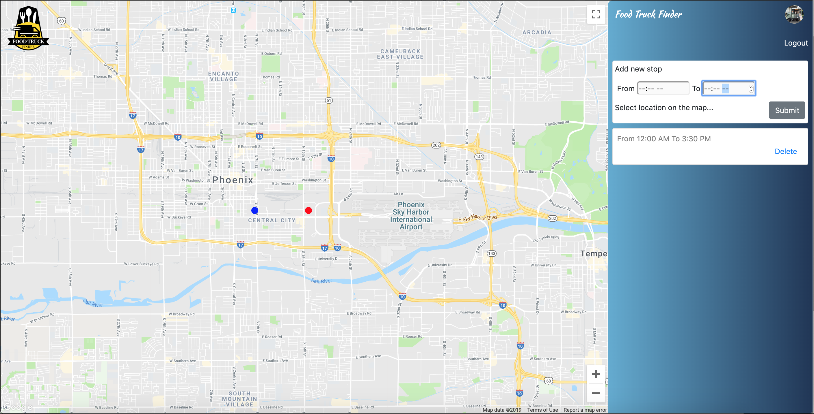
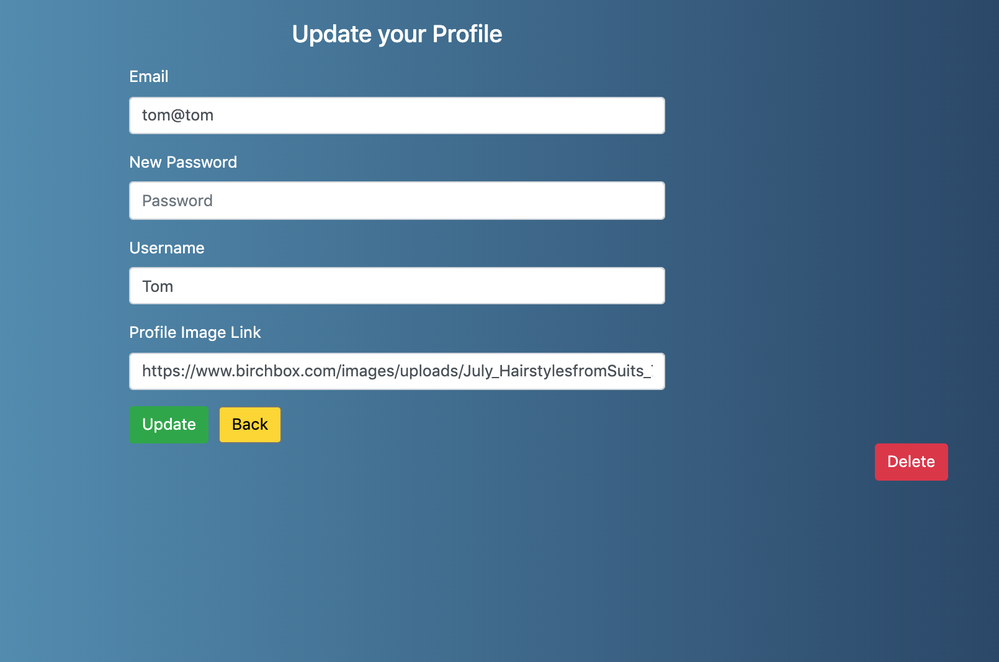

## Food Truck Finder

Food Truck Finder is Application for people who are food lovers and food truck lovers. App will be helpful for locating the nearest food truck or the food truck that user is looking for.

### General:

User can register, login, delete account, see all food trucks in his aria, left a review and set a truck as favorite.
User Food Truck can register, login, delete account and check in his location and time on the map.

### Auth:

As a user, when I arrive at the home page “/”, I am able to choose to register (with name, email, password and select a type of user (Food Truck or Regular user) and if I select a Food Truck user it will open input field for Description of Food Truck.
As a Regular or Food Truck user, I can sign in with email, and password

### Stretch:

As a user I can add picture to my profile

### Regular User Dashboard:

As a user, after I successfully log in, I am taken to my dashboard “/dashboard/user/” and I can see a list of food trucks listed by location and navbar with logo and Links to Home, Settings, and LogOut.
As a user I can save a food truck to my favorites and see them on my dashboard.

### Stretch:

As a user, on dashboard I will have a map with all food trucks around my location.

As a user, I have options to search a truck or click on the map to open more about truck.
As a user, when I open more about truck I will get an information about truck and working time for that location.

### Stretch:

As a user I can left a review for a food truck

### Food Truck User

As a Food Truck user, after I successfully log in, I am taken to my Food Truck dashboard “/truck-dashboard”
As a Food Truck user, I can checkin my location and time I will be on that location.

### Profile of Regular User

As a RegularUser, after I press Settings in navbar I will be forward to “/profile/user” where I can change my name, password and delete my Account

### Profile of Food Truck User

As a Food Truck User, after I press Settings in navbar I will be forward to “/profile/food-truck” where I can change my name, password and delete my Account
Stretch:
As a user I can update a picture to my profile

### Technologies:

FrontEnd: React, Redux, uuid, Axios, Bootstrap, Reactstrap, Google maps API, Font Awesome
BackEnd: Java Spring Boot, PostgreSQL

##Home - Login

##Home - Register

## User Dashboard

## Food Truck User Dashboard

## Update profile User

### How to run the App:

#### Backend:

- open backend folder wiht ItelliJ and run the app.

#### Frontend:

- cd to client
- npm start
